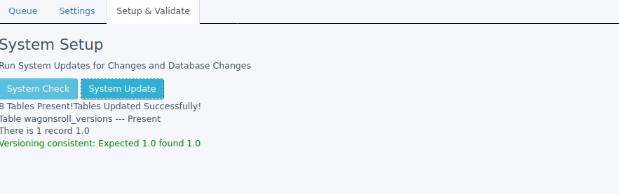
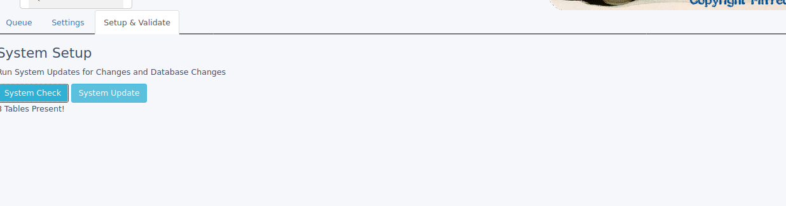
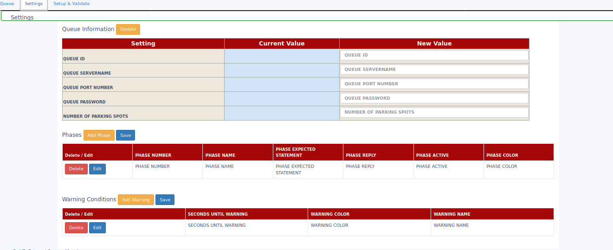

# WagonsRoll-Lite-Rosariosis
 Wagons Roll from FinTech Integration into Rosario SIS: Allows organizations to create a Pickup coordinated through simple text.

 This is an integration into Wagons Roll from the Rosario SIS system. The Pickup items are actually students in this case and not merchandise.
 The lite version creates a process flow between the pickup person and the location. In this case most likely parent (pickup person) and school (location).

 This was done for school dismissals during COVID.

### Process Flow
 --------------
 The process flow DOES NOT require any cellphone application to be installed. It is all done through Texting at the Parent end. 
 The flow is as follows:
 1. Parent Text they are in parking lot.
 2. Application prioritizes parent by putting them in the order of text received.
 	a. Rosario is used like a normal merchant vault and lookups the children to be picked up by use of the phone number.
 	b. WR then populates which children go with what line.
 3. Application texts parent when a pickup spot is 'Open' and informs them of the spot number.
 4. Teachers (just like warehose workers) can see the building queue to tell which children should get ready and move to pickup location.
 5. When pickup is complete, location closes the flow and Opens the Pickup Spot back up

 Large Transport Item Flow
 1. Buses are queue at the process open to be 'Awaited'.
 2. Buses normally will not text their presents so location marks notification of present.
 	a. A list of the days bus riders is put together out of Rosario and the Queue of student names is included.
 3. After bus is loaded, flow is closed.
    a. If limited bus spots, the next available bus is queue.

### Requirements
 ----------------
 1. Rosario SIS
 2. Wagons Roll Lite license (it is free for schools in 2020 & 2021)
 3. The system uses an IMAP technology so there is no cost to text parents and run this process.

### Settings
------------
1. Locations specify the number of Pickup Spots
2. You create a workflow that is the number of steps you need to become aware of parent pickup and conclude with safe pickup. Each step texts back to the parent a response and what to do next.
3. Staff Number override allows locations to put cell numbers into the system that will be ignored from lookup and used as a central device when Parents or buses do not text. The information in the text itself is used to reference and do the child names for pickup.
4. Specify a queue name.

### Other Screen Shots of Wagons Roll with Rosario Integration
--------------------------------------------------------

### Rosario Installation
------------------------
1. Copy Wagons Roll Lite to the Web Directory folder naming it wagonsroll
2. Copy the Rosario module Folder to the Rosario modules subfolder in the SIS System
3. Activate the module in Rosario like normal
4. Open Wagons roll as the SIS admin and go to Setup & Validate Tab
5. Click System Update.
6. Now follow the Wagons Roll Lite Readme to make Queues, Phases, Text Instructions, etc. 
Total setup time is about 10 minutes. Total school pickup for 300+ vehicles is about 15 minutes a day. Needed personnel is now minimal.
